<div align="center">

# رواق · Riwaq

**A calm, offline-first e-book reader.**

EPUB · PDF · Word — on Windows, macOS, Linux and Android.
No accounts, no sync, no analytics. Your books stay on your device.

[Download](#download) · [Features](#what-makes-it-good) · [Screenshots](#screenshots) · [Development](#development)

</div>

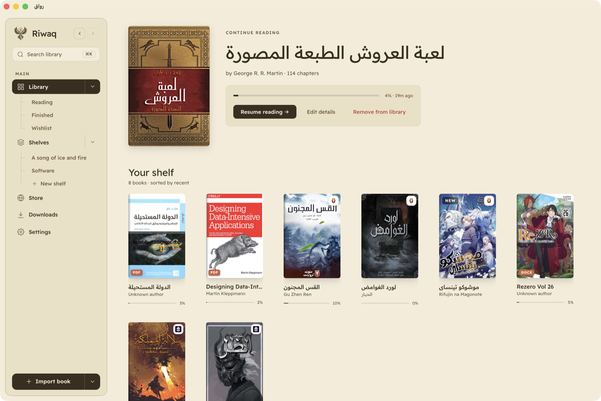

---

## What is Riwaq?

Riwaq (رواق) reads the books you already have — EPUBs, scanned PDFs, `.docx` drafts,
translated web novels — in whatever language they're written in. The interface comes in
English and Arabic, and it goes out of its way on the things long reading sessions depend
on: typography you can actually tune, layouts that hold still, and text that stays
readable for hours.

Right-to-left gets first-class treatment rather than an afterthought — mirrored interface,
diacritics, Naskh and Kufi faces — which is unusual enough to be worth saying out loud.

It is one app on every platform: a Tauri 2 shell around a React 19 front end, desktop and
phone from the same codebase. Everything is a file on your disk — no database, no cloud,
nothing to sign into.

---

## What makes it good

### 📚 A Store that reads the web for you

Browse Arabic web-novel sites from inside the app. Riwaq ships with three sources, renders
each site's own home page as native carousels, and searches them without opening a browser.
Pick a novel and you can **stream it chapter by chapter**, **add it to your library**, or
**download a range of chapters** for offline reading.

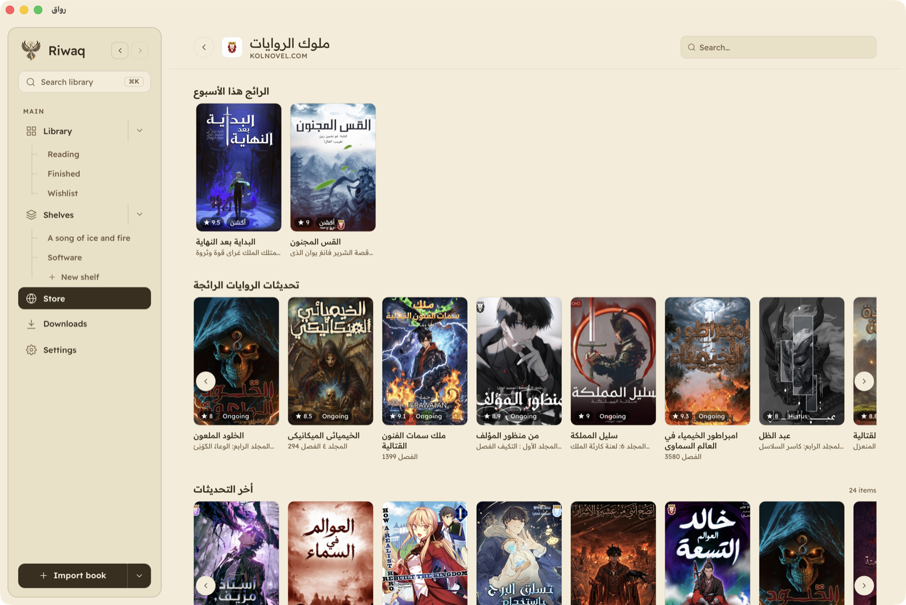

Every novel gets a real detail page — synopsis, genres, volumes, full chapter list — with
one-tap download per chapter or per volume.

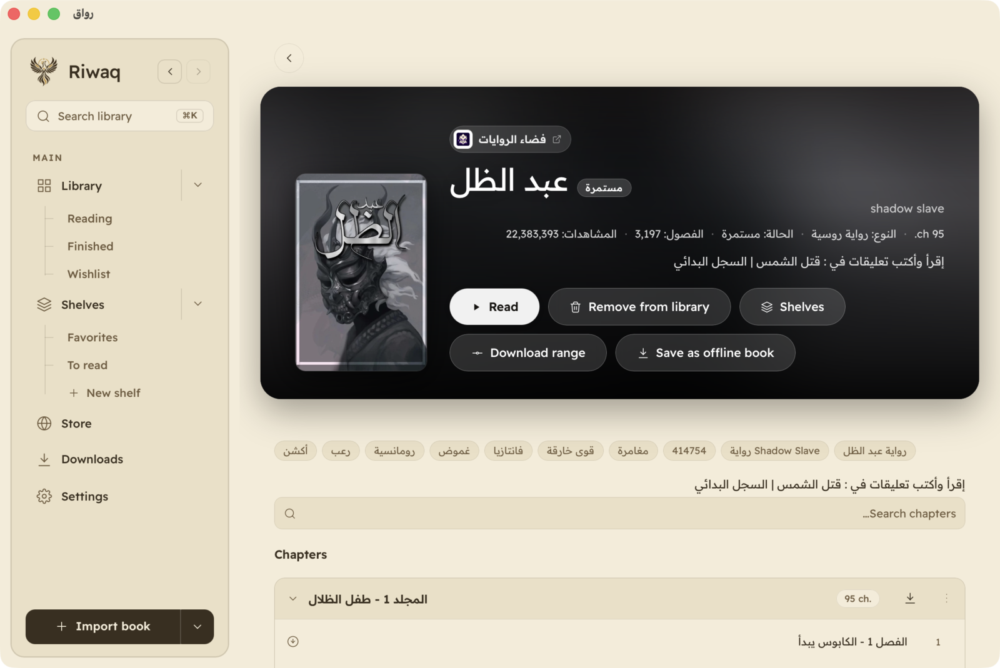

### 🌙 Focus mode

One click and everything but the page disappears. No toolbar, no progress bar, no chrome.
Move the pointer to the top or bottom edge and the controls come back.

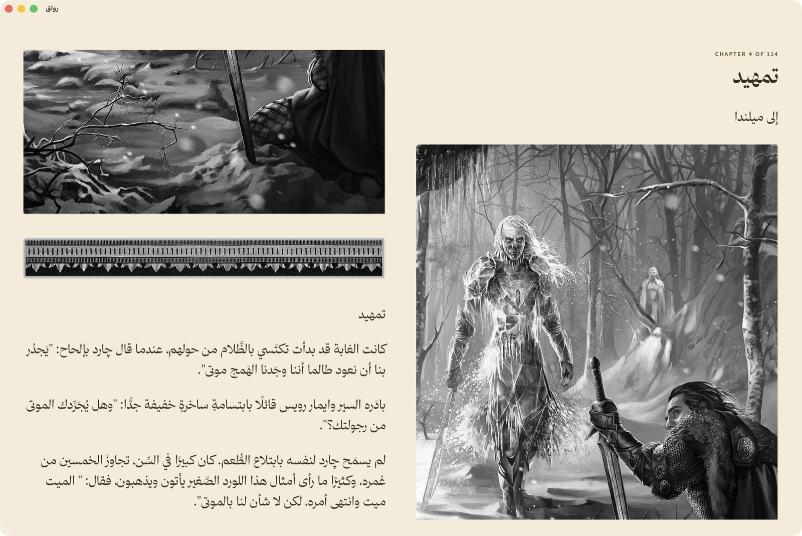

### ✍️ Typography you can actually tune

**16 reading faces** in four groups — Naskh book faces, modern sans, Kufi, and display.
One picker drives both scripts: every row previews Arabic and Latin side by side, and a
family that only carries one of them shows the fallback rather than hiding it. You pick by
eye, not by name.

<table>
<tr>
<td width="50%">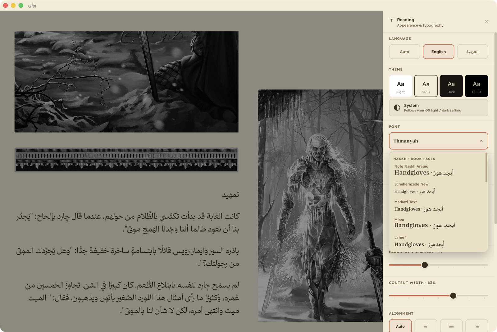</td>
<td width="50%">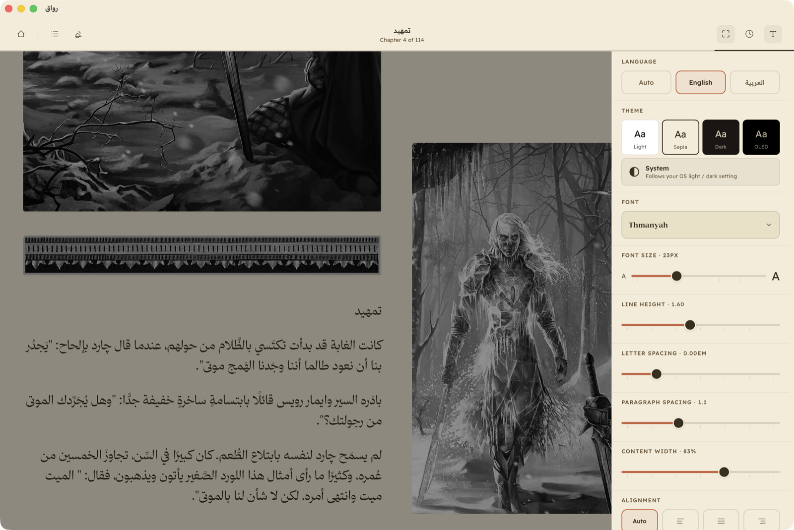</td>
</tr>
</table>

Then tune it: size, line height, letter spacing, paragraph spacing, content width,
alignment, hyphenation. Read as **two pages**, a **single page**, or a **continuous scroll**.

### 🎨 Four themes, light to OLED

Light, Sepia, Dark, and a true-black OLED — or follow your system.

<table>
<tr>
<td width="50%">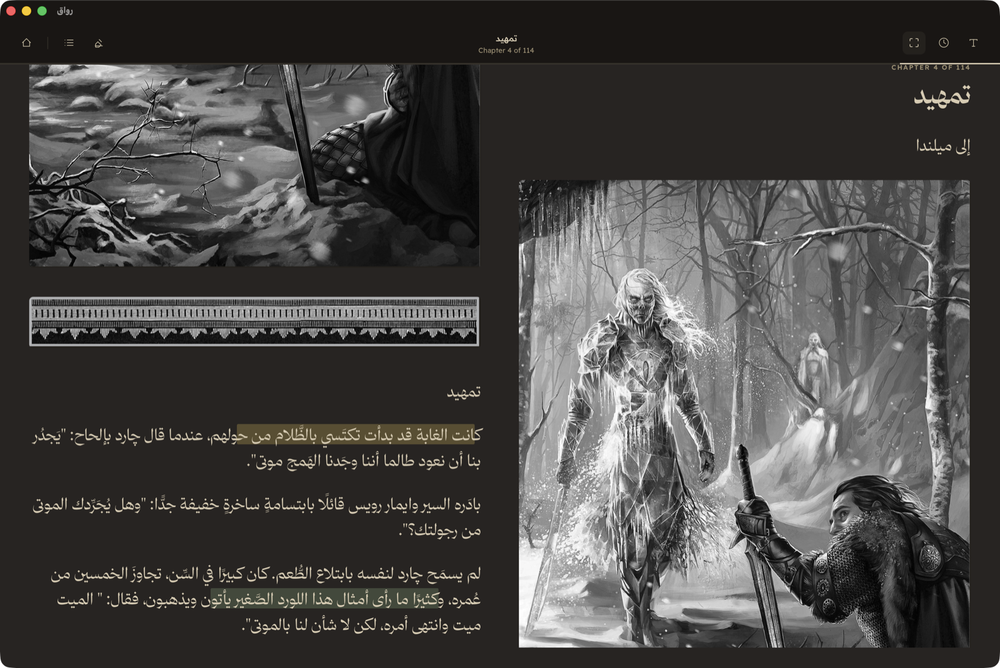</td>
<td width="50%">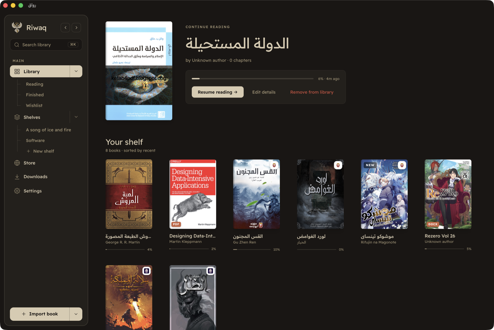</td>
</tr>
</table>

### 🖍️ Highlights you can actually find again

Select any passage, pick one of four colours, and attach a note about why it mattered.
The sidebar collects every highlight in the book with its chapter, so you can walk back
through them later.

<table>
<tr>
<td width="50%">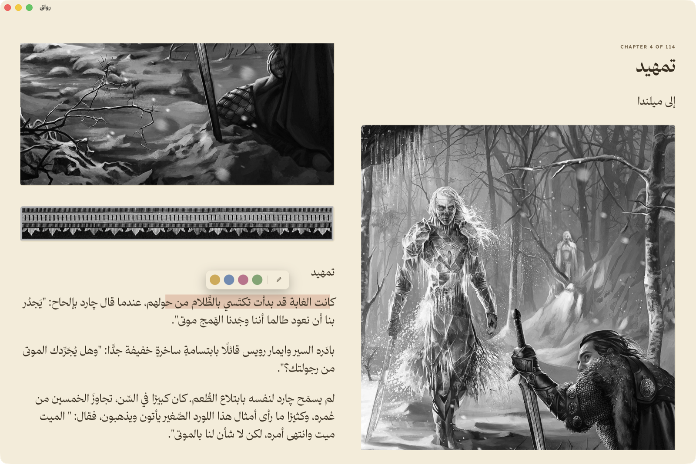</td>
<td width="50%"></td>
</tr>
</table>

### 🌐 Two interface languages, mirrored properly

English and العربية, and the translation goes all the way down — not just the book text.
Switch to Arabic and the sidebar moves to the right, icons flip, and every label follows.

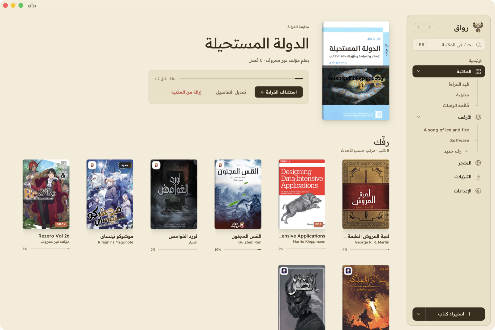

### 🗂️ A library that stays tidy

Reading progress on every cover, format badges for PDF and Word, source badges for novels,
status filters (Reading / Finished / Wishlist), and your own shelves for anything else.

`⌘K` opens a command palette over the whole app — search books and authors as you type, or
jump straight to any view.

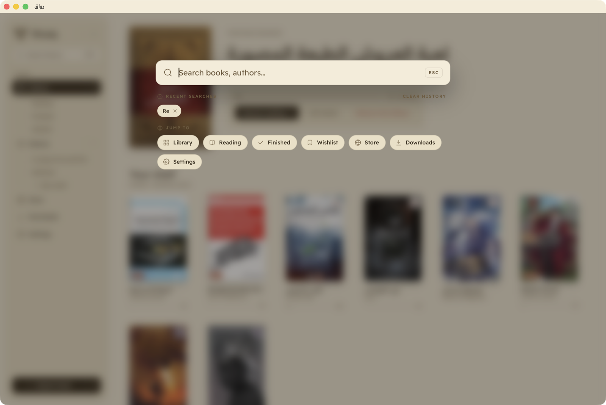

### ⬇️ Downloads that survive a restart

A real queue: per-chapter and per-volume downloads, concurrency limits, Wi-Fi-only mode,
retry for interrupted jobs, and system notifications while it works. Or bake a whole novel
into a standalone EPUB — one file, or one per volume — that lands in your library next to
everything else.

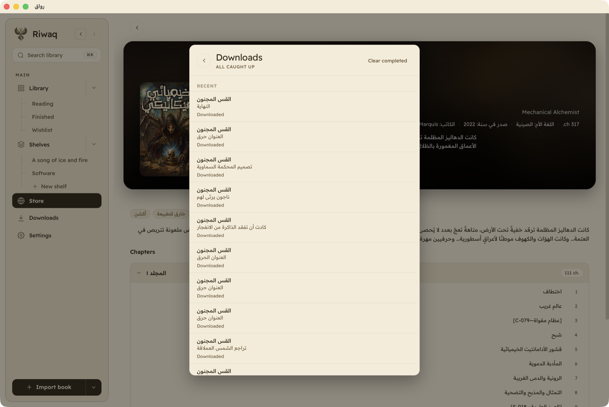

### 🗑️ …and downloads you can take back

Reclaim the disk without losing your place. Hover a downloaded chapter and its marker turns
into a delete button — one click, and a toast offers the download straight back. For a
bigger clear-out a volume will drop just the chapters you have already read, or all of them;
or long-press (right-click on desktop) any chapter to start selecting a run of them and
delete the lot in one go. Deleting only ever removes the file: the chapter stays in the list,
still readable online, and your reading progress is left alone.


<table>
<tr>
<td width="50%"></td>
<td width="50%"></td>
</tr>
</table>

### 📄 PDF and Word, not just EPUB

PDFs render through pdf.js with their own page controls — fit to width or page, scroll or
paged flow, zoom, and a page tint that dims or inverts a harsh scan. Word documents are
converted on import, with a step to pick the cover and review images first.

<table>
<tr>
<td width="50%">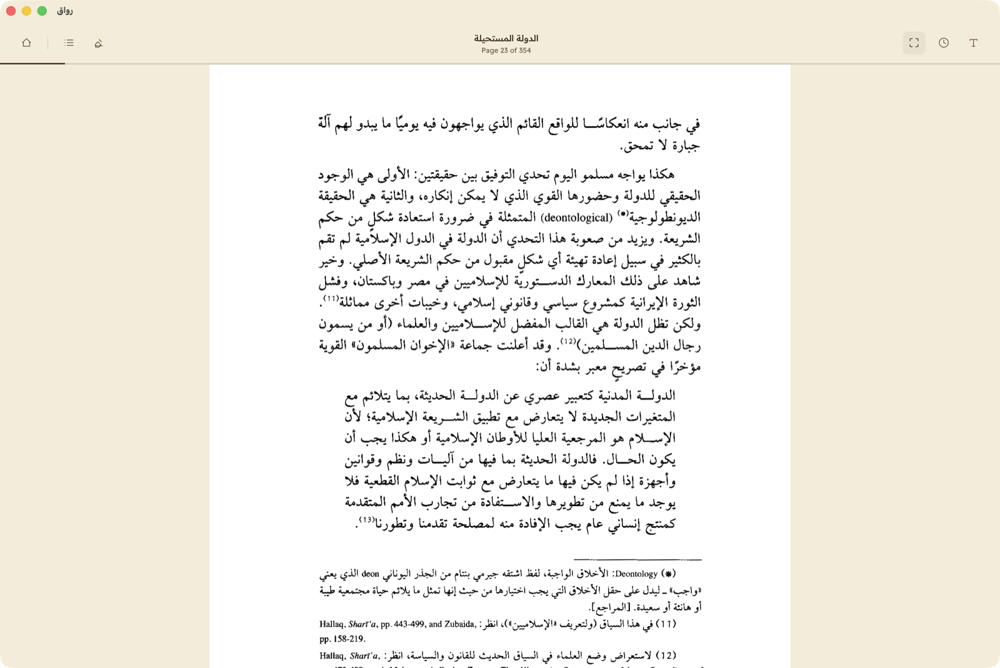</td>
<td width="50%">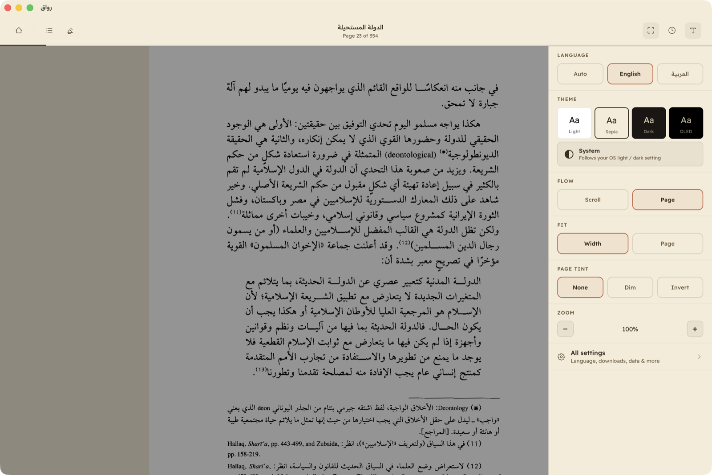</td>
</tr>
</table>

---

## Everything else

| | |
|---|---|
| **Formats** | EPUB 2 / 3, PDF, `.docx` |
| **Getting books in** | File picker, folder of EPUBs, drag and drop, or **Open with** from your file manager and Android's share sheet. Re-importing the same file reuses the existing book instead of duplicating it. |
| **Reader** | Two-page / single-page / scrolling layouts, tap-to-turn with adjustable zones, chapter progress bar, page-turn animation, keep-screen-awake |
| **Navigation** | Contents with per-volume grouping, chapter search, a *Now* marker and jump-to-current; a progress scrubber across the whole book |
| **Library** | Continue-reading hero, shelves, status filters, right-click menu, editable title / author / description / cover |
| **Settings** | A full settings page with its own search — appearance, reading, behaviour, downloads, data. Export, import, or reset every preference. |
| **Platforms** | Windows, macOS, Linux, Android — one codebase, layout-aware shells (bottom nav on phones, sidebar on desktop) |
| **Privacy** | No account, no sync, no telemetry. State is plain JSON on your disk. The only network traffic is the Store, when you use it. |

---

## Screenshots

### Desktop

<table>
  <tr>
    <td width="50%">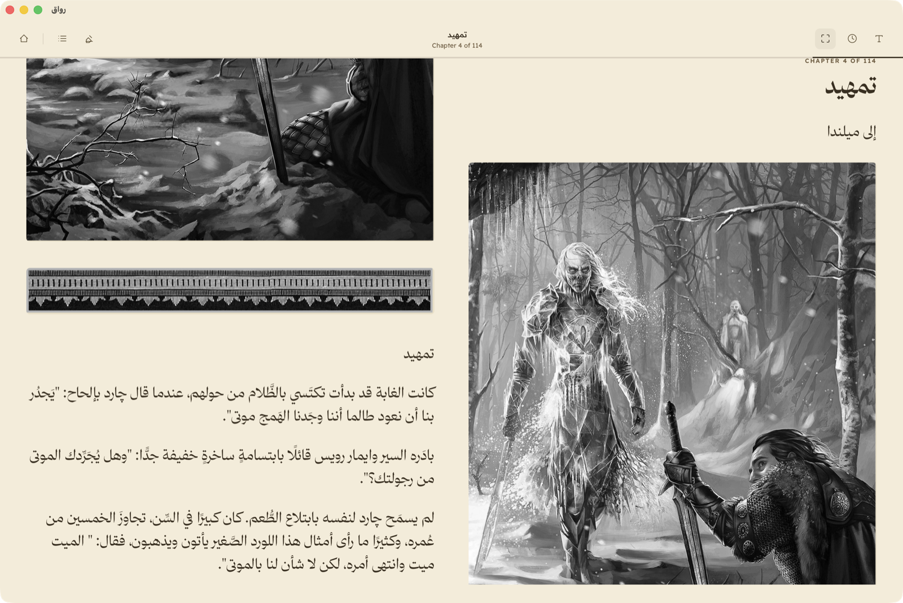<br/><b>Reader</b> — two-page RTL spread</td>
    <td width="50%">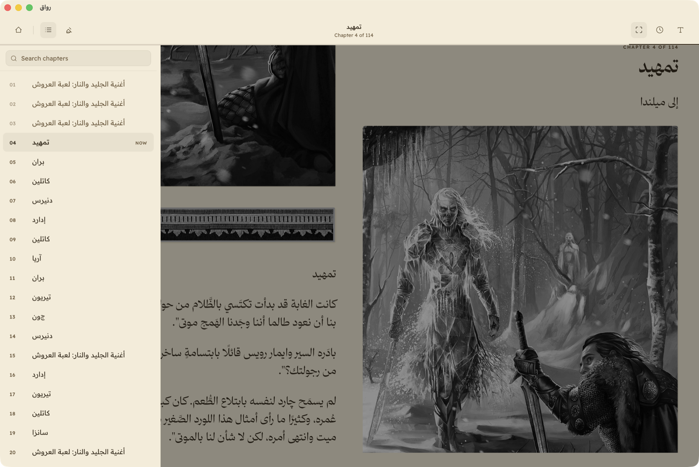<br/><b>Contents</b> — searchable, with a <i>Now</i> marker</td>
  </tr>
  <tr>
    <td width="50%">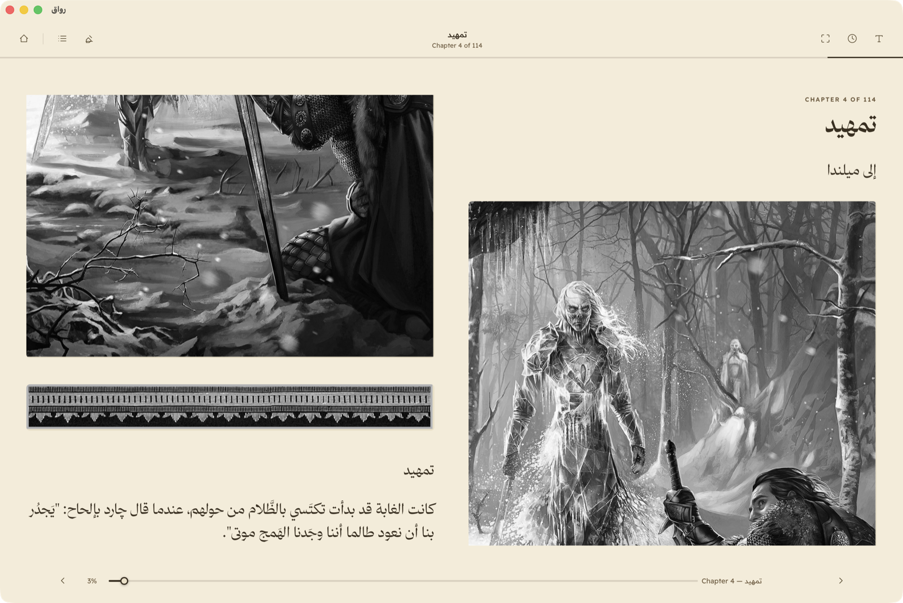<br/><b>Progress</b> — scrub the whole book</td>
    <td width="50%">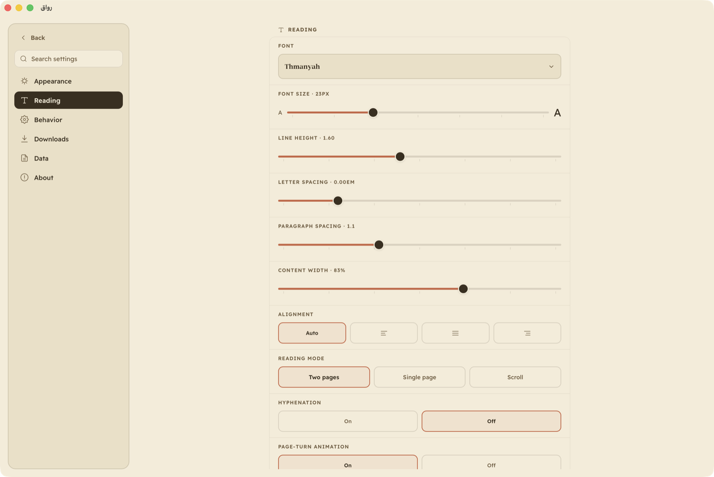<br/><b>Settings</b> — sectioned, searchable</td>
  </tr>
  <tr>
    <td width="50%">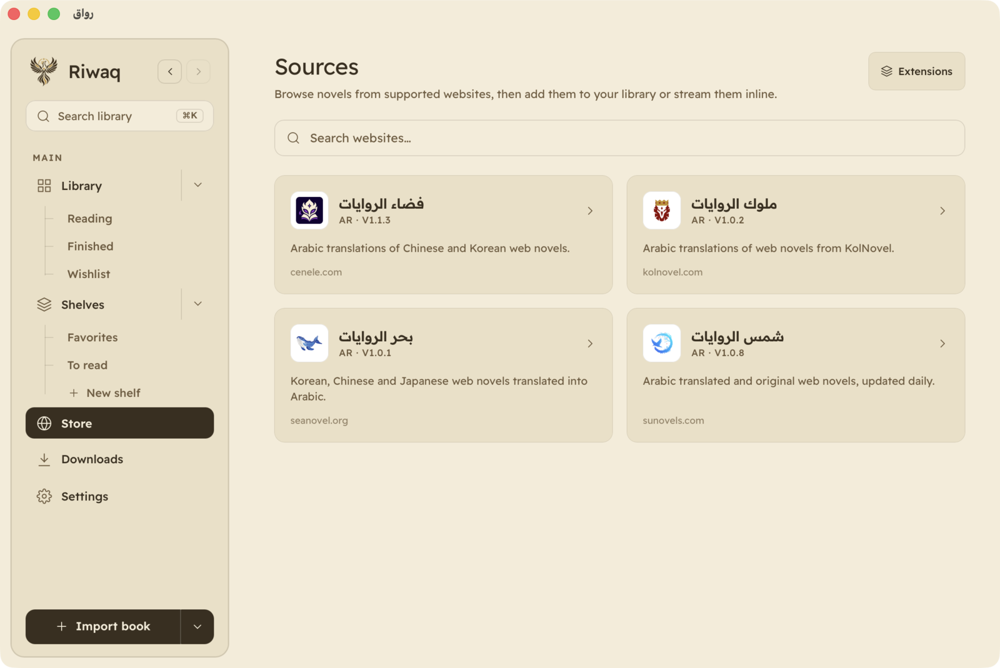<br/><b>Sources</b> — the sites Riwaq can browse</td>
    <td width="50%">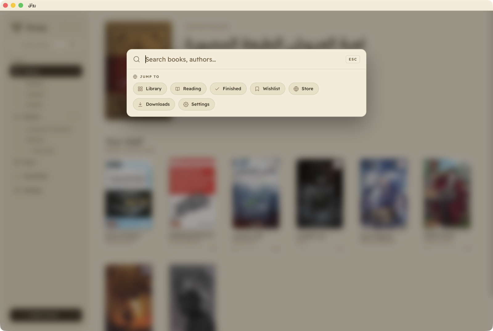<br/><b>Jump to</b> — reach any view from the palette</td>
  </tr>
</table>

### Android

<table>
  <tr>
    <td align="center" width="25%">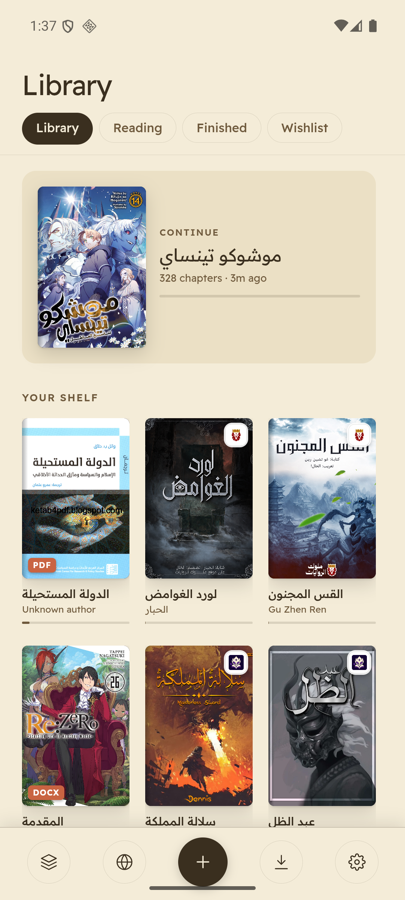<br/><b>Library</b></td>
    <td align="center" width="25%">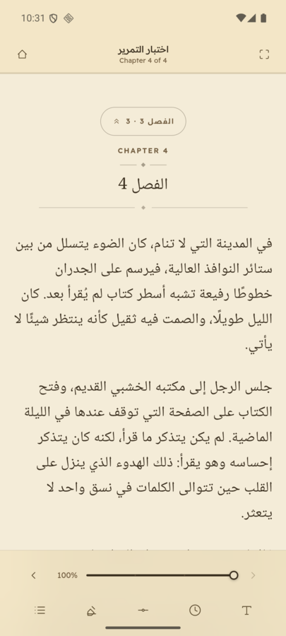<br/><b>Reader</b></td>
    <td align="center" width="25%">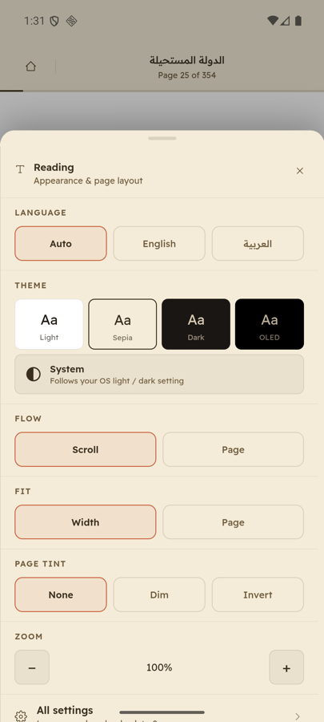<br/><b>Reading sheet</b></td>
    <td align="center" width="25%">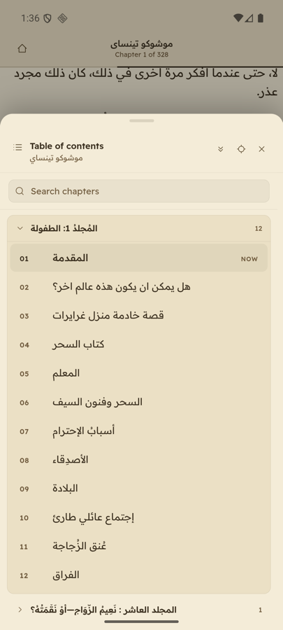<br/><b>Contents</b></td>
  </tr>
  <tr>
    <td align="center" width="25%">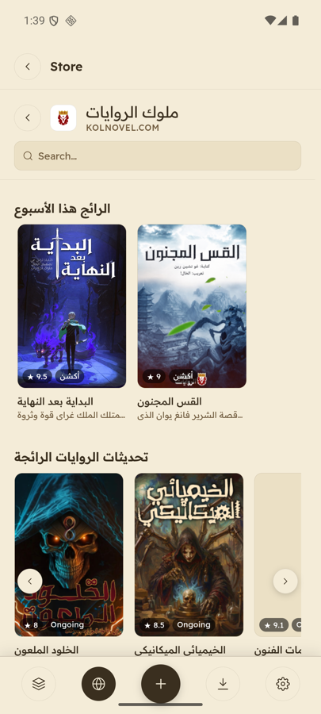<br/><b>Store</b></td>
    <td align="center" width="25%">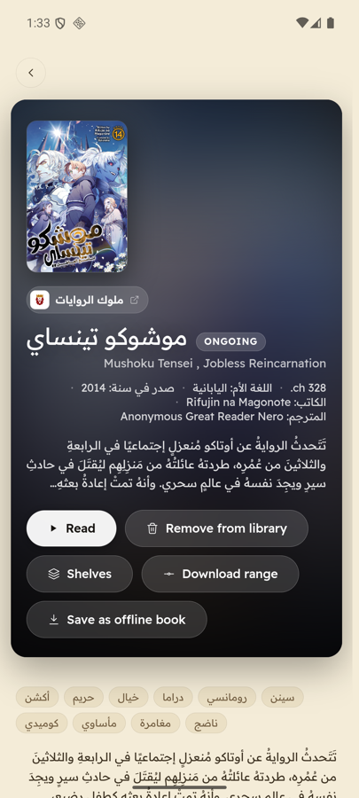<br/><b>Novel</b></td>
    <td align="center" width="25%">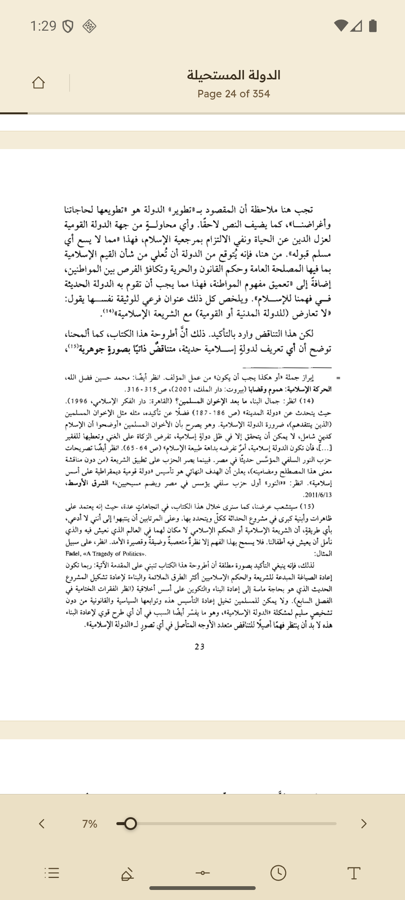<br/><b>PDF</b></td>
    <td align="center" width="25%">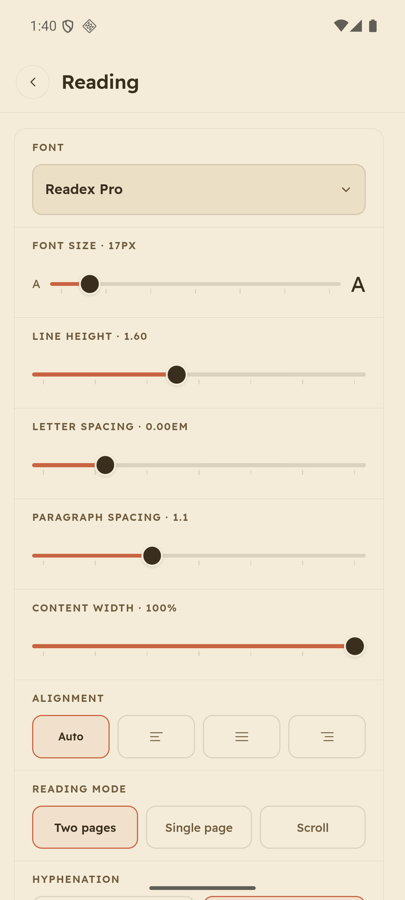<br/><b>Settings</b></td>
  </tr>
</table>

---

## Download

Builds are attached to each [GitHub Release](https://github.com/TheMostafaOsamaDev/Riwaq-Reader/releases).
Pick the file for your platform:

| Platform | File |
|---|---|
| **Windows** (most PCs) | `Riwaq_<ver>_x64-setup.exe` |
| **Windows on ARM** | `Riwaq_<ver>_arm64-setup.exe` |
| **macOS** (Intel **and** Apple Silicon) | `Riwaq_<ver>_universal.dmg` |
| **Linux** — Debian / Ubuntu | `Riwaq_<ver>_amd64.deb` · `_arm64.deb` |
| **Linux** — Fedora / RHEL | `Riwaq-<ver>-1.x86_64.rpm` · `.aarch64.rpm` |
| **Linux** — portable | `Riwaq_<ver>_amd64.AppImage` · `_aarch64.AppImage` |
| **Android** | `app-universal-release.apk` |

Windows ships the NSIS installer only. The `.msi` was dropped in v0.2.0 so there
is one install path and one upgrade path — if you installed v0.1.0 from the
`.msi`, uninstall it before installing a newer version.

### Android: get updates automatically

Riwaq can tell you when a new version exists, but on Android it cannot install
one — that is how sideloaded APKs work, so you would be tapping through a
download every time. [Obtainium](https://github.com/ImranR98/Obtainium) removes
that: it watches this repository and installs each release for you, the way an
app store would, with no account and nothing else in the middle.

<a href="https://apps.obtainium.imranr.dev/redirect?r=obtainium://app/%7B%22id%22%3A%22com.leaflet.reader%22%2C%22url%22%3A%22https%3A%2F%2Fgithub.com%2FTheMostafaOsamaDev%2FRiwaq-Reader%22%2C%22author%22%3A%22TheMostafaOsamaDev%22%2C%22name%22%3A%22Riwaq%22%7D"></a>

Open that on the phone itself. It hands Obtainium the whole app definition —
id, repository, name — so there is nothing to type. Without Obtainium
installed, the link explains where to get it rather than failing silently.

Prefer to do it by hand? Add `https://github.com/TheMostafaOsamaDev/Riwaq-Reader`
as a **GitHub** source in Obtainium, or just grab the `.apk` above.

### First launch

The builds aren't code-signed yet, so desktop systems warn once. These steps don't recur.

<details>
<summary><b>Windows</b></summary>

SmartScreen shows *"Windows protected your PC"* → **More info** → **Run anyway**.
Or before launching: right-click the installer → **Properties** → tick **Unblock** → OK.
</details>

<details>
<summary><b>macOS</b></summary>

Gatekeeper blocks unsigned, un-notarized apps. Open the `.dmg`, drag **Riwaq** to
Applications, then **right-click the app → Open → Open**. If it still refuses, clear the
quarantine flag:

```bash
xattr -dr com.apple.quarantine /Applications/Riwaq.app
```
</details>

<details>
<summary><b>Linux</b></summary>

The `.deb` / `.rpm` install and run as-is. For the AppImage, mark it executable first:

```bash
chmod +x Riwaq_*.AppImage && ./Riwaq_*.AppImage
```
</details>

<details>
<summary><b>Android</b></summary>

Sideload the APK — your browser or file manager will ask you to allow *"install from
unknown sources"*. Play Store distribution isn't planned; F-Droid is a possible future
channel.
</details>

<details>
<summary><b>Verifying your download</b></summary>

Every release ships a `SHA256SUMS` manifest. Put it next to your download and check:

- Linux: `sha256sum --ignore-missing -c SHA256SUMS`
- macOS: `shasum -a 256 <file>`, then compare with the matching line in `SHA256SUMS`
</details>

### Updates

Riwaq asks GitHub, at most once a day, whether a newer version exists. That is
the only network request the app makes on its own behalf, and it is a single
unauthenticated GET for one static file. **Nothing about you or your books is
sent** — no identifiers, no library contents, no reading data — and nothing is
downloaded until you tap Update.

Turn it off in **Settings → About → Check for updates**, and the app stays
fully functional with it off.

Where a new version can be installed from inside the app, it is: Windows, macOS,
and Linux via the AppImage. The other three — Android, and Linux `.deb`/`.rpm`
— can't be updated in place, so Riwaq shows the same notice and takes you to the
download instead. That is a limitation of how those packages install, not a
choice about who gets updates.

---

## Sources

| Source | Site | Notes |
|---|---|---|
| **فضاء الروايات** | [cenele.com](https://cenele.com) | Arabic translations of Asian web novels. Some pages sit behind bot protection; the first request to a chapter may need a session refresh. |
| **ملوك الروايات** | [kolnovel.com](https://kolnovel.com) | Arabic translations of Korean / Chinese / Japanese web novels. |
| **ملوك الروايات** | [kolnovel.com](https://kolnovel.com) | The same site again, through Riwaq's alternate **Pro** reader. |

Riwaq hosts and redistributes nothing. The Store reads publicly available pages so you can
read them offline. Support the translators and official releases where they exist.

---

## Development

```bash
pnpm install
pnpm tauri dev          # desktop, with Vite HMR
pnpm android:dev        # Android, on a device or emulator
pnpm test               # unit tests (Vitest)
pnpm check              # format, lint, typecheck, build, test — what CI runs
pnpm tauri build        # production bundles for the current OS
```

Vite serves on port **1420** (HMR on 1421) and a single dev server backs both the desktop
window and Android at once. For Android, the device must reach the host over your LAN — or
use `adb reverse tcp:1420 tcp:1420` on an emulator.

[`CONTRIBUTING.md`](CONTRIBUTING.md) covers the conventions worth knowing before the first
PR. More detail lives in [`docs/`](docs/): [`setup.md`](docs/setup.md) for toolchains and
bundling, [`architecture.md`](docs/architecture.md) for module boundaries and data flow,
[`ANDROID.md`](docs/ANDROID.md) for the Android specifics,
[`store-feature/`](docs/store-feature/README.md) for how source extensions work, and
[`maintenance.md`](docs/maintenance.md) for the periodic housekeeping.

### Stack

- **[Tauri 2](https://tauri.app)** — desktop + mobile shell (Rust)
- **[React 19](https://react.dev)** + **TypeScript** + **[Vite](https://vite.dev)**
- **[pdf.js](https://mozilla.github.io/pdf.js/)** for PDFs, **[JSZip](https://stuk.github.io/jszip/)** for EPUB, **[Mammoth](https://github.com/mwilliamson/mammoth.js)** for `.docx`
- State persists as JSON through Tauri's filesystem plugin — no SQLite, no IndexedDB, no server

---

## Fonts

Every face ships inside the app and is served locally — Riwaq makes no font requests at
runtime.

Bundled under the [SIL Open Font License 1.1](https://scripts.sil.org/OFL), each with its
license text alongside it in [`public/fonts/`](public/fonts):

**Readex Pro** (interface) · **Noto Naskh Arabic** · **Scheherazade New** ·
**Markazi Text** · **Mirza** · **Lateef** · **Cairo** · **Tajawal** · **Almarai** ·
**IBM Plex Sans Arabic** · **Alexandria** · **Vazirmatn** · **El Messiri** ·
**Noto Kufi Arabic** · **Changa** · **Lalezar**

Every bundled face carries its license text. Nothing ships without one.

---

## License

[MIT](LICENSE).
