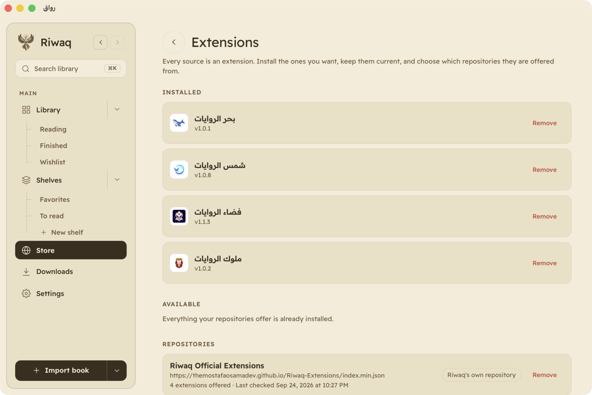
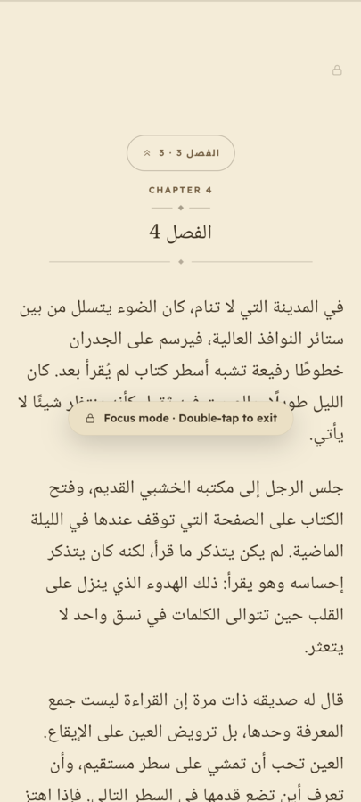
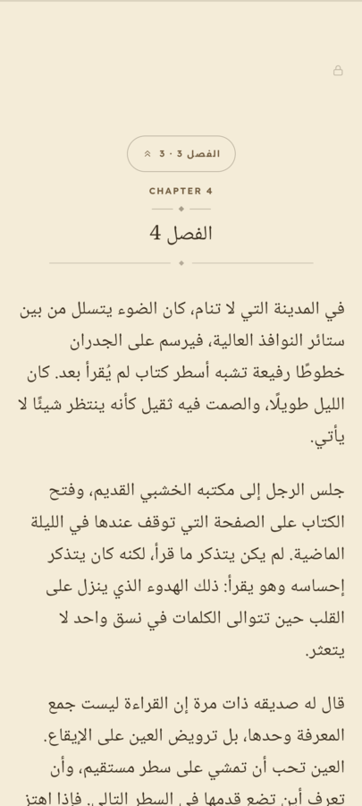
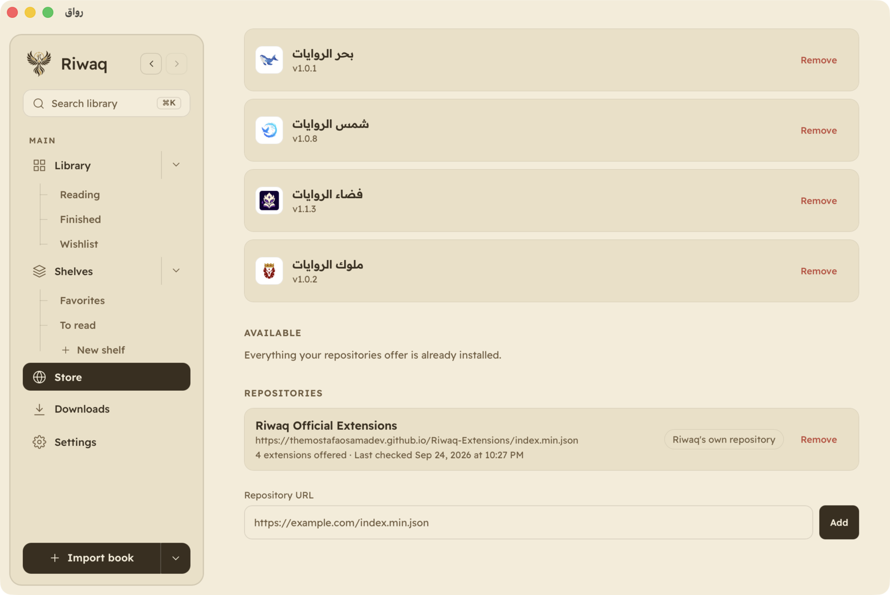
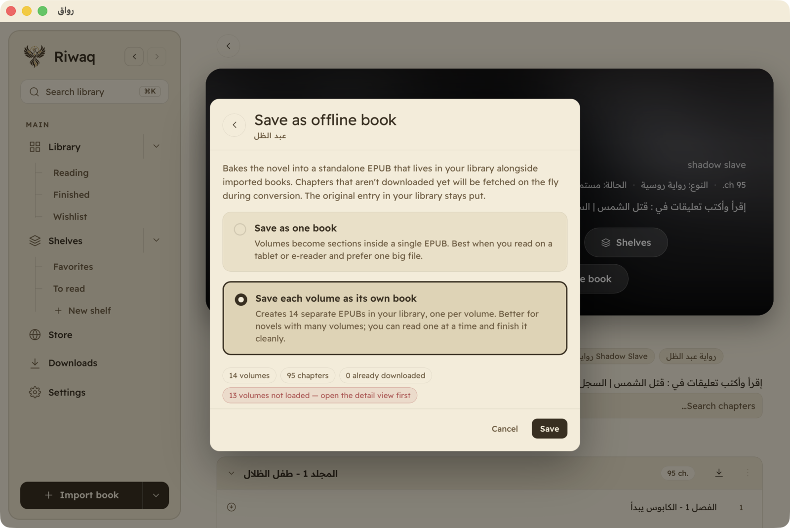

<div align="center">


# رواق · Riwaq

**A calm, offline-first e-book reader.** EPUB, PDF and Word files, on Windows,
macOS, Linux and Android. No accounts, no sync, no analytics.

<p align="center">
<a href="https://github.com/TheMostafaOsamaDev/Riwaq-Reader/releases/latest"></a>
<a href="https://apps.obtainium.imranr.dev/redirect?r=obtainium://app/%7B%22id%22%3A%22com.riwaq.reader%22%2C%22url%22%3A%22https%3A%2F%2Fgithub.com%2FTheMostafaOsamaDev%2FRiwaq-Reader%22%2C%22author%22%3A%22TheMostafaOsamaDev%22%2C%22name%22%3A%22Riwaq%22%7D"></a>
<a href="https://github.com/RookieEnough/Orion-Store"></a>
</p>

<sub>GitHub and Obtainium work today. Orion Store is submitted and waiting on
review; F-Droid and Flathub are not submitted yet. Badges go up as each
store goes live.</sub>

</div>


Riwaq (رواق) reads the books you already own: EPUBs, scanned PDFs, `.docx` drafts,
translated web novels, whatever language they happen to be written in. Arabic gets the same
care as English rather than a mirrored stylesheet and a shrug. Six of the sixteen bundled
faces are Naskh or Kufi, diacritics render properly, and switching the interface to العربية
moves the sidebar, flips the icons and translates every label.

## In one table

| | |
|---|---|
| Read | EPUB 2/3, PDF, `.docx`. Two pages, one page, or a continuous scroll. Tap to turn, with zones you can resize. |
| Type | 16 bundled faces across Naskh, modern sans, Kufi and display. Size, line height, letter spacing, paragraph spacing, width, alignment, hyphenation. |
| Themes | Light, Sepia, Dark, and a true black for OLED. Or follow the system. |
| Focus mode | Everything but the page goes, including Android's system bars. Double tap, or tap the lock, to come back. |
| Highlight | Four colours, notes, and a sidebar that collects every one with the chapter it came from. |
| Store | Browse Arabic web novel sites inside the app. Read online, add to the library, download a range of chapters, or bake the lot into one EPUB. |
| Extensions | Sources install at runtime from a repository. Add your own. Nothing is compiled in. |
| Languages | English and العربية, mirrored all the way down. |
| Privacy | No account, no sync, no telemetry. Plain JSON on your disk. |

## Three things it does differently

### Sources are extensions

No website is compiled into Riwaq. Each source installs from a repository and updates on
its own schedule, so when a site changes its markup it can be fixed without shipping a new
version of the app. Riwaq's own repository is set up out of the box, and you can add
others. If a repository cannot be reached, the list falls back to the copy already on your
device instead of emptying itself.



An extension runs inside the app with the app's reach, so adding a repository asks you to
confirm that you trust whoever publishes it.

### Focus mode knows it is a mode

On desktop the toolbar comes back when the pointer nears an edge. A phone has no pointer,
so it tells you instead: entering names the mode and the gesture that leaves it, and a
small lock stays in the corner afterwards. The lock is also a button. If you never saw the
message, or a double tap does not register for you, there is still something on screen you
can press.

<table>
<tr>
<td width="33%"></td>
<td width="33%"></td>
<td width="33%"></td>
</tr>
</table>

### The size slider means one thing

Set the same pixel size in Lateef and in Readex Pro and you get noticeably different text,
because the faces carry different amounts of ink. Riwaq measures each one and corrects for
it, so 17px reads as 17px whichever of the sixteen you pick. Chapter titles follow the face
you chose too, at a fixed ratio to the body.

<table>
<tr>
<td width="50%"></td>
<td width="50%"></td>
</tr>
</table>

## Screenshots

<details>
<summary><b>Desktop</b>: reader, contents, progress, settings, store, palette</summary>
<br/>
<table>
  <tr>
    <td width="50%"><br/><b>Reader</b></td>
    <td width="50%"><br/><b>Contents</b></td>
  </tr>
  <tr>
    <td width="50%"><br/><b>Focus mode</b></td>
    <td width="50%"><br/><b>Progress</b></td>
  </tr>
  <tr>
    <td width="50%"><br/><b>Dark</b></td>
    <td width="50%"><br/><b>Arabic, mirrored</b></td>
  </tr>
  <tr>
    <td width="50%"><br/><b>Highlights</b></td>
    <td width="50%"><br/><b>Colours &amp; notes</b></td>
  </tr>
  <tr>
    <td width="50%"><br/><b>Sources</b></td>
    <td width="50%"><br/><b>Novel detail</b></td>
  </tr>
  <tr>
    <td width="50%"><br/><b>Browsing a source</b></td>
    <td width="50%"><br/><b>Repositories</b></td>
  </tr>
  <tr>
    <td width="50%"><br/><b>Download queue</b></td>
    <td width="50%"><br/><b>Save as one EPUB</b></td>
  </tr>
  <tr>
    <td width="50%"><br/><b>Take a download back</b></td>
    <td width="50%"><br/><b>…or a run of them</b></td>
  </tr>
  <tr>
    <td width="50%"><br/><b>Or a whole volume</b></td>
    <td width="50%"><br/><b>PDF</b></td>
  </tr>
  <tr>
    <td width="50%"><br/><b>PDF controls</b></td>
    <td width="50%"><br/><b>Settings</b></td>
  </tr>
  <tr>
    <td width="50%"><br/><b>⌘K palette</b></td>
    <td width="50%"><br/><b>Jump to any view</b></td>
  </tr>
  <tr>
    <td width="50%"><br/><b>Dark library</b></td>
    <td width="50%"><br/><b>Extensions</b></td>
  </tr>
</table>
</details>

<details>
<summary><b>Android</b>: library, reader, sheets, store, focus mode</summary>
<br/>
<table>
  <tr>
    <td align="center" width="25%"><br/><b>Library</b></td>
    <td align="center" width="25%"><br/><b>Reader</b></td>
    <td align="center" width="25%"><br/><b>Reading sheet</b></td>
    <td align="center" width="25%"><br/><b>Contents</b></td>
  </tr>
  <tr>
    <td align="center" width="25%"><br/><b>Store</b></td>
    <td align="center" width="25%"><br/><b>Novel</b></td>
    <td align="center" width="25%"><br/><b>PDF</b></td>
    <td align="center" width="25%"><br/><b>Settings</b></td>
  </tr>
  <tr>
    <td align="center" width="25%"><br/><b>Focus, entering</b></td>
    <td align="center" width="25%"><br/><b>Focus, at rest</b></td>
    <td align="center" width="25%"></td>
    <td align="center" width="25%"></td>
  </tr>
</table>
</details>

---

## Download

Builds are attached to each [GitHub Release](https://github.com/TheMostafaOsamaDev/Riwaq-Reader/releases).
Pick the file for your platform:

| Platform | File |
|---|---|
| **Windows** (most PCs) | `Riwaq_<ver>_x64-setup.exe` |
| **Windows on ARM** | `Riwaq_<ver>_arm64-setup.exe` |
| **macOS** (Intel **and** Apple Silicon) | `Riwaq_<ver>_universal.dmg` |
| **Linux**, Debian / Ubuntu | `Riwaq_<ver>_amd64.deb` · `_arm64.deb` |
| **Linux**, Fedora / RHEL | `Riwaq-<ver>-1.x86_64.rpm` · `.aarch64.rpm` |
| **Linux**, portable | `Riwaq_<ver>_amd64.AppImage` · `_aarch64.AppImage` |
| **Android** | `app-universal-release.apk` |

Windows ships the NSIS installer only. The `.msi` was dropped in v0.2.0 so there
is one install path and one upgrade path. If you installed v0.1.0 from the
`.msi`, uninstall it before installing a newer version.

### Android: get updates automatically

Riwaq can tell you when a new version exists, but on Android it cannot install
one. That is how sideloaded APKs work, so you would be tapping through a
download every time. [Obtainium](https://github.com/ImranR98/Obtainium) removes
that: it watches this repository and installs each release for you, the way an
app store would, with no account and nothing else in the middle.

<a href="https://apps.obtainium.imranr.dev/redirect?r=obtainium://app/%7B%22id%22%3A%22com.riwaq.reader%22%2C%22url%22%3A%22https%3A%2F%2Fgithub.com%2FTheMostafaOsamaDev%2FRiwaq-Reader%22%2C%22author%22%3A%22TheMostafaOsamaDev%22%2C%22name%22%3A%22Riwaq%22%7D"></a>

Open that on the phone itself. It hands Obtainium the whole app definition
(id, repository, name), so there is nothing to type. Without Obtainium
installed, the link explains where to get it rather than failing silently.

Prefer to do it by hand? Add `https://github.com/TheMostafaOsamaDev/Riwaq-Reader`
as a **GitHub** source in Obtainium, or just grab the `.apk` above.

### First launch

The builds aren't code-signed yet, so desktop systems warn once. These steps don't recur.

<details>
<summary><b>Windows</b></summary>

SmartScreen shows *"Windows protected your PC"* → **More info** → **Run anyway**.
Or before launching: right-click the installer → **Properties** → tick **Unblock** → OK.
</details>

<details>
<summary><b>macOS</b></summary>

Gatekeeper blocks unsigned, un-notarized apps. Open the `.dmg`, drag **Riwaq** to
Applications, then **right-click the app → Open → Open**. If it still refuses, clear the
quarantine flag:

```bash
xattr -dr com.apple.quarantine /Applications/Riwaq.app
```
</details>

<details>
<summary><b>Linux</b></summary>

The `.deb` / `.rpm` install and run as-is. For the AppImage, mark it executable first:

```bash
chmod +x Riwaq_*.AppImage && ./Riwaq_*.AppImage
```
</details>

<details>
<summary><b>Android</b></summary>

Sideload the APK. Your browser or file manager will ask you to allow *"install from
unknown sources"*. Play Store distribution isn't planned; F-Droid is a possible future
channel.
</details>

<details>
<summary><b>Verifying your download</b></summary>

Every release ships a `SHA256SUMS` manifest. Put it next to your download and check:

- Linux: `sha256sum --ignore-missing -c SHA256SUMS`
- macOS: `shasum -a 256 <file>`, then compare with the matching line in `SHA256SUMS`
</details>

### Updates

Riwaq asks GitHub, at most once a day, whether a newer version exists. That is
the only network request the app makes on its own behalf, and it is a single
unauthenticated GET for one static file. **Nothing about you or your books is
sent**: no identifiers, no library contents, no reading data. Nothing is
downloaded until you tap Update.

Turn it off in **Settings → About → Check for updates**, and the app stays
fully functional with it off.

Where a new version can be installed from inside the app, it is: Windows, macOS,
and Linux via the AppImage. The other three (Android, and Linux `.deb`/`.rpm`)
can't be updated in place, so Riwaq shows the same notice and takes you to the
download instead. That is a limitation of how those packages install, not a
choice about who gets updates.

---

## Sources

Sources are extensions, published from
[Riwaq-Extensions](https://github.com/TheMostafaOsamaDev/Riwaq-Extensions), the repository
Riwaq is configured with out of the box. The roster changes there rather than here, so
**Store → Extensions** in the app is always the current list. At the time of writing it
offers:

| Extension | Site | What it carries |
|---|---|---|
| **فضاء الروايات** | [cenele.com](https://cenele.com) | Chinese and Korean web novels translated into Arabic. Some pages sit behind bot protection, so the first request to a chapter may need a session refresh. |
| **ملوك الروايات** | [kolnovel.com](https://kolnovel.com) | Arabic translations of web novels from KolNovel. |
| **بحر الروايات** | [seanovel.org](https://seanovel.org) | Korean, Chinese and Japanese web novels translated into Arabic. |
| **شمس الروايات** | [sunovels.com](https://sunovels.com) | Arabic translated and original web novels, updated daily. |

Riwaq hosts and redistributes nothing. The Store reads publicly available pages so you can
read them offline. Support the translators and official releases where they exist.

---

## Development

```bash
pnpm install
pnpm tauri dev          # desktop, with Vite HMR
pnpm android:dev        # Android, on a device or emulator
pnpm test               # unit tests (Vitest)
pnpm check              # format, lint, typecheck, build, test (what CI runs)
pnpm tauri build        # production bundles for the current OS
```

Vite serves on port **1420** (HMR on 1421) and a single dev server backs both the desktop
window and Android at once. For Android, the device must reach the host over your LAN, or
use `adb reverse tcp:1420 tcp:1420` on an emulator.

[`CONTRIBUTING.md`](CONTRIBUTING.md) covers the conventions worth knowing before the first
PR. More detail lives in [`docs/`](docs/): [`setup.md`](docs/setup.md) for toolchains and
bundling, [`architecture.md`](docs/architecture.md) for module boundaries and data flow,
[`ANDROID.md`](docs/ANDROID.md) for the Android specifics,
[`store-feature/`](docs/store-feature/README.md) for how source extensions work, and
[`maintenance.md`](docs/maintenance.md) for the periodic housekeeping.

### Stack

- **[Tauri 2](https://tauri.app)**: desktop and mobile shell (Rust)
- **[React 19](https://react.dev)** + **TypeScript** + **[Vite](https://vite.dev)**
- **[pdf.js](https://mozilla.github.io/pdf.js/)** for PDFs, **[JSZip](https://stuk.github.io/jszip/)** for EPUB, **[Mammoth](https://github.com/mwilliamson/mammoth.js)** for `.docx`
- State persists as JSON through Tauri's filesystem plugin. No SQLite, no IndexedDB, no server

---

## Fonts

Every face ships inside the app and is served locally, so Riwaq makes no font requests at
runtime.

Bundled under the [SIL Open Font License 1.1](https://scripts.sil.org/OFL), each with its
license text alongside it in [`public/fonts/`](public/fonts):

**Readex Pro** (interface) · **Noto Naskh Arabic** · **Scheherazade New** ·
**Markazi Text** · **Mirza** · **Lateef** · **Cairo** · **Tajawal** · **Almarai** ·
**IBM Plex Sans Arabic** · **Alexandria** · **Vazirmatn** · **El Messiri** ·
**Noto Kufi Arabic** · **Changa** · **Lalezar**

Every bundled face carries its license text. Nothing ships without one.

---

## License

[MIT](LICENSE).
